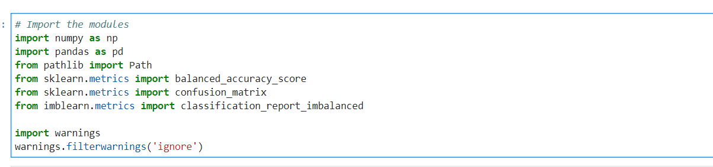
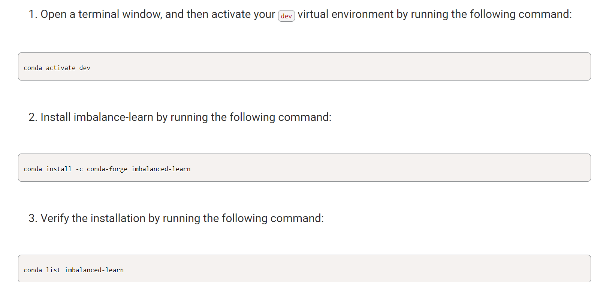
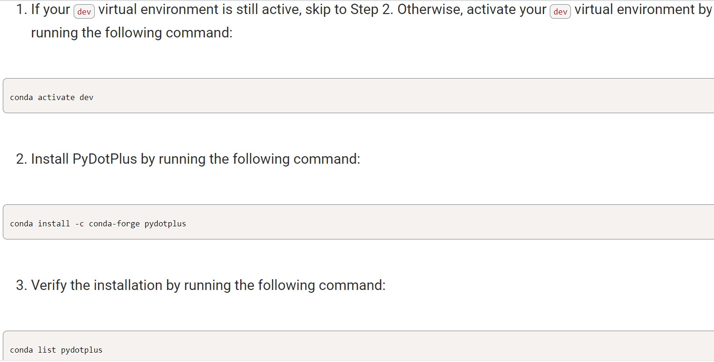
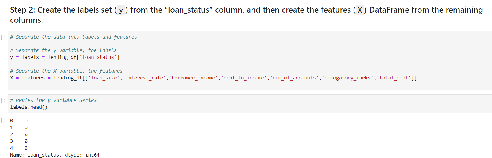
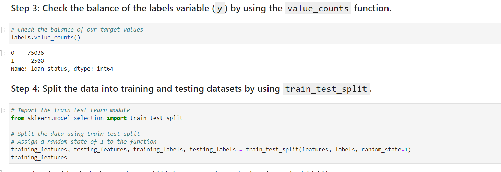

# Identifying-Creditworthiness
Credit risk poses a classification problem that’s inherently imbalanced. This is because healthy loans easily outnumber risky loans. I used various techniques to train and evaluate models with imbalanced classes. I used a dataset of historical lending activity from a peer-to-peer lending services company to build a model that can identify the creditworthiness of borrowers.

## Technologies
Resources included 1 csv file:

(Resources/lending_data.csv)

Tools

Libraries and dependencies:
import numpy as np
import pandas as pd
from pathlib import Path
from sklearn.metrics import balanced_accuracy_score
from sklearn.metrics import confusion_matrix
from imblearn.metrics import classification_report_imbalanced

import warnings
warnings.filterwarnings('ignore')

## Installation Guide
Installation requirements for this project included Python and Panda Libraries,
conda install -c conda-forge imbalanced-learn
conda install -c conda-forge pydotplus

## Results
Create X and Y

Train the model

Fit and predict and test accuracy
![](
Although the original data had an imbalance of information between good credit worthy loans vs the small amount of high-risk loans, the models' predictive capablities still scored quite high in the 80%  using the logistical regression model original data and even the oversize resampled data. Over all the model did a good job rediciting high risk loans and an excellent job predicting healthy loans with 100% accuracy.

## Contributors

#### Contact
zehra.vahidy@gmail.com
LinkedIn https://www.linkedin.com/in/zehra-vahidy-6025b820

---

## License

Unlicesened

## Appendix
https://docs.github.com/en/get-started/writing-on-github/getting-started-with-writing-and-formatting-on-github/basic-writing-and-formatting-syntax#headings
https://jupyterlab.readthedocs.io/en/stable/
